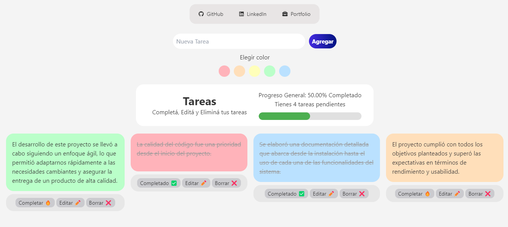

# Proyecto: Gestión de Tareas y Progreso
## Imágen del Proyecto

## Descripción:
Crear una aplicación web para gestionar tareas personales o de equipo, donde puedas crear, editar, eliminar, y marcar tareas como completadas. Además, la aplicación permitirá visualizar el progreso general en un dashboard y gestionar usuarios para asignarles tareas (próximamente).

## Características del Proyecto:
- Basic Syntax: Toda la lógica básica de la aplicación estará escrita en JavaScript moderno, utilizando la sintaxis más reciente.

- Events: Implementarás eventos para manejar interacciones del usuario, como hacer clic en botones para agregar nuevas tareas, marcar tareas como completadas, y cambiar entre diferentes vistas.

- Variables (let & const): Utilizarás let y const adecuadamente para manejar variables de estado y constantes en tu código.

- Template Literals: Generarás HTML dinámico utilizando template literals para insertar variables y expresiones directamente en las cadenas de texto.

- Arrow Functions: Utilizarás funciones flecha para crear funciones anónimas y callbacks en eventos y promesas.

- Spread/Rest Operators: Implementarás el operador spread/rest para manejar arrays y objetos, como en la copia de listas de tareas o la combinación de propiedades de un objeto.

- Object/Array Destructuring: Desestructurarás objetos y arrays para acceder fácilmente a las propiedades y valores que necesitas en tu lógica de negocio.

- Class and Objects: Diseñarás clases para manejar la lógica de las tareas y usuarios, utilizando objetos para representar cada entidad. 

- Module Imports/Exports: Dividirás el código en módulos, utilizando import y export para organizar tu aplicación en diferentes archivos.

- Promises, async/await: Implementarás promesas y async/await para manejar operaciones asíncronas, como la simulación de guardar tareas en una base de datos o consultar datos de un servidor.

## Estructura del Proyecto:

- Pantalla Principal: Un dashboard donde se muestran las tareas pendientes y completadas, con un resumen del progreso.
- Gestión de Tareas: Formulario para agregar nuevas tareas.
- Listado de tareas donde se puede marcar como completadas o eliminarlas.
- Posibilidad de editar tareas existentes.
- Gestión de Usuarios (Opcional): Implementación de un sistema simple de usuarios para asignar tareas y ver progreso individual.

## Módulos: 
- taskManager.js: Módulo para la lógica de gestión de tareas.
- userManager.js: Módulo para la lógica de gestión de usuarios. (opcional)
- utils.js: Funciones auxiliares para operaciones comunes. (opcional)
- main.js: Entrada principal de la aplicación, donde se inicializan los eventos y la lógica.

## Stack
- HTML/CSS: Para la estructura y el estilo de la aplicación.
- JavaScript: Toda la lógica de la aplicación se desarrollará con JavaScript.
- Parcel/Webpack (opcional): Para empaquetar y servir los módulos JavaScript.

## Paso a Paso:
- Configurar el entorno de desarrollo.
- Crear la estructura básica de HTML y enlazar archivos JavaScript.
- Desarrollar el módulo de gestión de tareas con clases y objetos.
- Implementar la funcionalidad de eventos y manipulación del DOM.
- Utilizar promesas y async/await para simular operaciones asíncronas.
- Dividir la lógica en módulos y utilizar imports/exports.
- Estilizar la aplicación con CSS o TailwindCSS/DaisyUI.