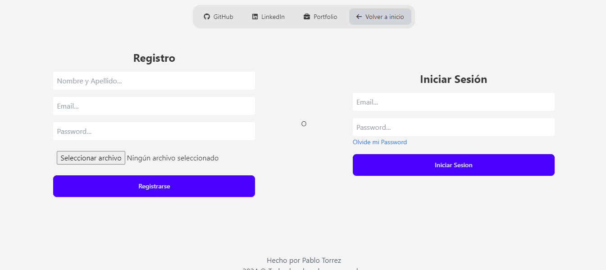
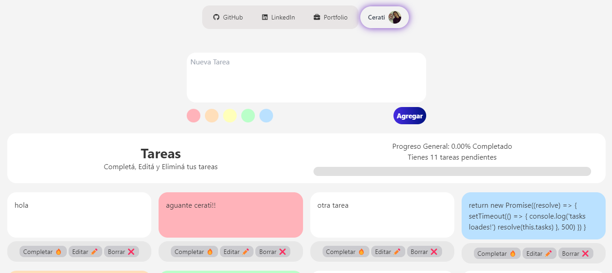

# 🚀 Proyecto: Sistema de Gestión de Tareas con Autenticación de Usuarios

Este sistema utiliza, en dos ramas, versiones muy diferentes: 
- En la rama `version_db` implementé MEJN Stack: **JavaScript Vanilla**, **Node.js**, **Express**, **MySQL** con **Axios**, **CORS** y **localStorage** para el manejo de la base de datos, autenticación y almacenamiento en el lado del cliente.
- Luego, en la rama `version_supabase`, usé: **JavaScript Vanilla**, **Node.js**, **Express**, **SUPABASE** (alternativa a Firebase, usa PostgreSQL) con **CORS** y **localStorage**.
- Para los estilos usé TailwindCSS en complemento con Daisy.ui

## Imágen del Proyecto

## Características técnicas del Proyecto:
- Basic Syntax: Toda la lógica básica de la aplicación estará escrita en JavaScript moderno, utilizando la sintaxis más reciente.

- Events: Implementarás eventos para manejar interacciones del usuario, como hacer clic en botones para agregar nuevas tareas, marcar tareas como completadas, y cambiar entre diferentes vistas.

- Variables (let & const): Utilizarás let y const adecuadamente para manejar variables de estado y constantes en tu código.

- Template Literals: Generarás HTML dinámico utilizando template literals para insertar variables y expresiones directamente en las cadenas de texto.

- Arrow Functions: Utilizarás funciones flecha para crear funciones anónimas y callbacks en eventos y promesas.

- Spread/Rest Operators: Implementarás el operador spread/rest para manejar arrays y objetos, como en la copia de listas de tareas o la combinación de propiedades de un objeto.

- Object/Array Destructuring: Desestructurarás objetos y arrays para acceder fácilmente a las propiedades y valores que necesitas en tu lógica de negocio.

- Class and Objects: Diseñarás clases para manejar la lógica de las tareas y usuarios, utilizando objetos para representar cada entidad. 

- Module Imports/Exports: Dividirás el código en módulos, utilizando import y export para organizar tu aplicación en diferentes archivos.

- Promises, async/await: Implementarás promesas y async/await para manejar operaciones asíncronas, como la simulación de guardar tareas en una base de datos o consultar datos de un servidor.

## Estructura del Proyecto:

- Pantalla Principal: Un dashboard donde se muestran las tareas pendientes y completadas, con un resumen del progreso.
- Gestión de Tareas: Formulario para agregar nuevas tareas.
- Listado de tareas donde se puede marcar como completadas o eliminarlas.
- Posibilidad de editar tareas existentes.
- Gestión de Usuarios (Opcional): Implementación de un sistema simple de usuarios para asignar tareas y ver progreso individual.

---

## 📁 Archivo: `mysql/db.sql`

La base de datos contiene una tabla `USUARIOS` que almacena los datos de los usuarios registrados. Los campos principales incluyen:

- `ID_USUARIO`
- `NOMBRE_APELLIDO`
- `EMAIL`
- `PASSWORD`
- `CREATED_AT`

Se utiliza un esquema sencillo para registrar usuarios en la tabla y probar la funcionalidad de registro y autenticación.

---

## 📁 Archivo: `api/rutas.js`

En esta carpeta están almacenadas variables de rutas de la api

## 📁 Archivo: `backend/debugger/solicitud.js`

Este archivo sirve para hacer depuración por si hay alguna falla en el código. Es totalmente independiente de todo el proyecto. Se puede editar si se requiere.

## 📁 Archivo: `backend/uploads`

En esta carpeta se almacenan los íconos (fotos de perfil) de cada usuario cuando se registra por primera vez.

## 📁 Archivo: `backend/server.js`

Este archivo es crucial ya que permite la interacción entre el **frontend** y la **base de datos**. Algunas de las características clave incluyen:

- **CORS**: Se utiliza para permitir solicitudes entre diferentes dominios, habilitando la interacción entre el frontend y backend.
  
- **Configuración del servidor**:
  - `app.use(express.json())`: Para parsear el body de las solicitudes HTTP.
  - `app.use(cors({...}))`: Permite el acceso al servidor desde diferentes orígenes.
  - `app.use((req, res, next) => { res.set('Cache-Control', 'no-store'); ... })`: Evita el almacenamiento en caché para gestionar correctamente el historial de navegación.
  
- **Endpoints**:
  - `/register` y `/login`: Gestionan el registro e inicio de sesión de usuarios.
  
- **Manejo de errores**: Implementa diferentes estados de respuesta (`200`, `400`, `401`, `500`) para gestionar los errores y respuestas del servidor.
  
---

## 📁 Archivo: `src/historyObj.js`

Este archivo gestiona el historial de navegación del usuario, detectando si la navegación es desde caché o usando las flechas del historial. Aún se deben resolver algunos problemas de redirección.

---

## 📁 Archivo: `src/loader.js`

Crea una animación de "cargando" para mejorar la interactividad del sistema. Se usa `setTimeout` para manejar el tiempo de carga.

---

## 📁 Archivo: `src/logoutbutton.js`

Configura el botón "Cerrar Sesión", eliminando al usuario logueado del `localStorage`, mejorando la experiencia cuando se desea cambiar de cuenta.

---

## 📁 Archivo: `src/main.js`

Maneja los eventos globales, la carga del dashboard de tareas y la lógica del usuario. Usa `async/await` para gestionar la lógica de las tareas.

---

## 📁 Archivo: `src/registro.js`

Archivo clave para la autenticación del usuario. Usa `axios` para enviar solicitudes POST al servidor en los endpoints `/register` y `/login`, y maneja la respuesta de manera asíncrona. 

---

## 📁 Archivo: `src/taskManager.js`

Maneja la lógica de las tareas usando clases y objetos. Proporciona funcionalidades como:

- `calcularPorcentaje()`: Calcula el porcentaje de tareas completadas.
- `addOrUpdateTask()`: Agrega o actualiza tareas, asignándoles un color y almacenándolas en la base de datos.
- `toggleTaskCompletion(id)`: Marca las tareas como completadas según su ID.
- `deleteTask(id)`: Elimina tareas por su ID.
- `renderTasks()`: Renderiza las tareas en el DOM, manipulando elementos de forma dinámica.

---

## 📁 Archivo: `src/userLogged.mjs`

Módulo para la autenticación de usuarios, gestionando el `localStorage`. Algunas funciones clave incluyen:

1. `saveUserToLS(email, nombreApellido)`: Guarda los datos del usuario en `localStorage`.
2. `getLoggedInUser()`: Recupera los datos del usuario logueado desde `localStorage`.
3. `userLogged(selector)`: Muestra el nombre del usuario logueado en la UI.

El sistema actual solo gestiona un usuario logueado a la vez.

---

## 📁 Archivo: `src/userManager.js`

Módulo para la lógica de gestión de usuarios. (opcional)

---

## 📁 Archivo: `src/utils.js`

Funciones auxiliares para operaciones comunes. (opcional)

---

## Instalaciones / Dependencias
### Rama `version_db`
* CORS: `npm install cors`
* EXPRESS: `npm install express`
* AXIOS: `npm install axios`
* MYSQL: `npm install mysql`
* MULTER: `npm install multer`
* FS: `npm install fs`
* PATH: `npm install path`

### Rama `version_supabase`
* CORS: `npm install cors`
* EXPRESS: `npm install express`
* MULTER: `npm install multer`
* FS: `npm install fs`
* PATH: `npm install path`
* SUPABASE: `npm install @supabase/supabase-js`
* NODEMON: `npm install nodemon`

# Breve resumen
- Básicamente la diferencia de `version_db` es que uso MySQL con Axios y en la otra rama `version_supabase` me manejo sin ellos, directamente con la API de Supabase. (express uso para manejar el servidor en ambas ramas)

## Proyecto hecho por [Pablo Torrez](https://wwww.github.com/pblnahu1/)